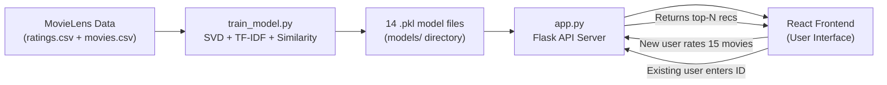
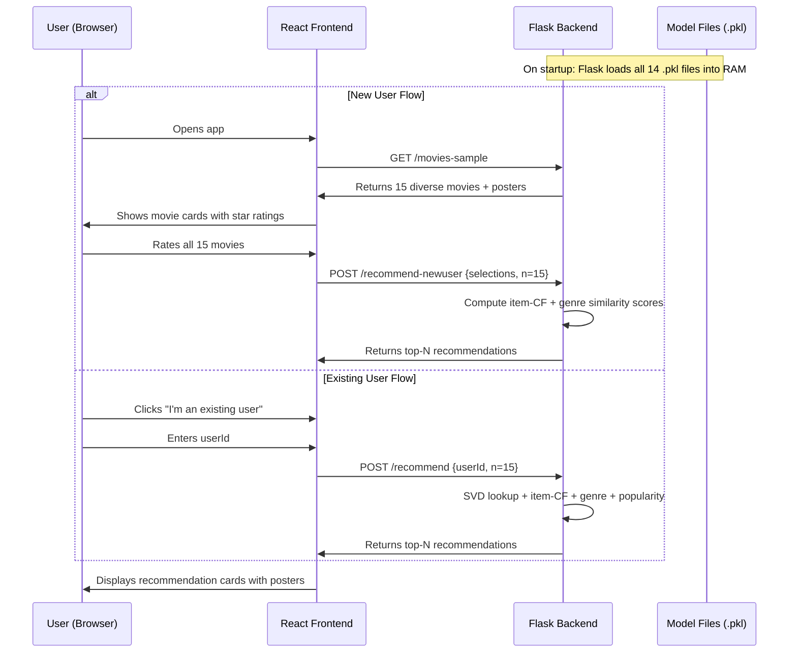

# Movie Recommendation System — Complete Deep Dive

> A full-stack hybrid recommender system combining **SVD collaborative filtering**, **TF-IDF content-based filtering**, and **item-item similarity** to recommend movies. Built with **Python/Flask** (backend) and **React/Material UI** (frontend) on the **MovieLens** dataset.

---

## Table of Contents

1. [Project Overview & Architecture](#1-project-overview--architecture)
2. [Dataset & Data Files](#2-dataset--data-files)
3. [Python ML Deep Dive: `train_model.py`](#3-python-ml-deep-dive-train_modelpy) ⭐
4. [Python ML Deep Dive: `evaluate_model.py`](#4-python-ml-deep-dive-evaluate_modelpy) ⭐
5. [Python ML Deep Dive: `app.py` (Serving Predictions)](#5-python-ml-deep-dive-apppy-serving-predictions) ⭐
6. [Frontend Overview](#6-frontend-overview)
7. [End-to-End Flow](#7-end-to-end-flow)
8. [Key ML Concepts Explained](#8-key-ml-concepts-explained)

---

## 1. Project Overview & Architecture

```
Movie_Recommendation_System/
├── backend/
│   ├── app.py                  ← Flask API server (serves recommendations)
│   ├── train_model.py          ← ML training pipeline (SVD + hybrid)
│   ├── evaluate_model.py       ← Model evaluation (RMSE, NDCG, etc.)
│   ├── requirements.txt        ← Python dependencies
│   ├── data/
│   │   ├── ratings.csv         ← MovieLens user-movie ratings
│   │   └── movies.csv          ← Movie metadata (title, genres)
│   ├── models/                 ← Trained model artifacts (.pkl files)
│   └── venv/                   ← Python virtual environment
├── frontend/
│   ├── src/
│   │   ├── App.js              ← Main React app (3-step flow)
│   │   ├── components/
│   │   │   ├── MovieSelector.js    ← Movie rating cards (cold-start)
│   │   │   └── Recommendations.js  ← Recommendation display cards
│   │   └── services/
│   │       └── api.js          ← API helper functions
│   └── package.json
├── .gitignore
└── Readme.md
```

### How the System Works (High-Level)



### The Hybrid Approach

This isn't a single-algorithm recommender. It's a **hybrid system** that blends three strategies:

| Strategy | What It Does | Weight |
|---|---|---|
| **SVD (Collaborative Filtering)** | Finds latent patterns in how users rate movies (e.g., "users who liked X also liked Y") | `alpha = 0.6` |
| **Item-Based CF** | Computes pairwise cosine similarity between movies based on rating vectors | `beta = 0.25` |
| **Content-Based (TF-IDF)** | Compares movie genre tags to recommend genre-similar movies | `gamma = 0.15` |
| **Popularity Bias** | Slight boost for well-known, highly-rated movies | `0.05` |

---

## 2. Dataset & Data Files

The system uses the **MovieLens** dataset from GroupLens Research:

| File | Contents | Example Row |
|---|---|---|
| `ratings.csv` | `userId, movieId, rating, timestamp` | `1, 31, 2.5, 1260759144` |
| `movies.csv` | `movieId, title, genres` | `1, Toy Story (1995), Animation\|Children\|Comedy` |

The `ratings.csv` has **~100,000 ratings** from **~610 users** across **~9,700 movies** (MovieLens Small dataset).

### Generated Model Artifacts (14 `.pkl` files)

| File | Size | What It Stores |
|---|---|---|
| `U.pkl` | 244 KB | Left singular vectors (users in latent space) |
| `sigma.pkl` | 20 KB | Diagonal matrix of singular values |
| `Vt.pkl` | 3.9 MB | Right singular vectors (movies in latent space) |
| `predicted_ratings.pkl` | 47 MB | Full user×movie predicted rating matrix |
| `user_ratings_mean.pkl` | 5 KB | Per-user average rating (for de-meaning) |
| `user_id_to_index.pkl` | 3 KB | Maps userId → matrix row index |
| `movie_id_to_index.pkl` | 63 KB | Maps movieId → matrix column index |
| `genre_matrix.pkl` | 304 KB | TF-IDF sparse matrix of movie genres |
| `item_sim_matrix.pkl` | 756 MB | Rating-based movie×movie cosine similarity |
| `item_sim_genre.pkl` | 756 MB | Genre-based movie×movie cosine similarity |
| `movie_stats.pkl` | 312 KB | Per-movie avg rating, count, popularity score |
| `moviemeta.pkl` | 604 KB | Full movies DataFrame (metadata) |
| `movieidmap.pkl` | 63 KB | Maps movieId → row index in movies DataFrame |
| `eval_summary.pkl` | 234 B | Hyperparameter search results (k → RMSE/NDCG) |

---

## 3. Python ML Deep Dive: `train_model.py` ⭐

> **Purpose**: This is the heart of the ML system. It loads the raw MovieLens data, trains an SVD model, builds content-based features, computes item-item similarities, and saves everything to disk as `.pkl` files.

Source: [train_model.py](file:///c:/Users/Public/Documents/Movie_Recommendation_System/backend/train_model.py)

---

### Lines 1–13: Imports

```python
import pandas as pd                                    # DataFrames for tabular data
import numpy as np                                     # Numerical arrays and linear algebra
import pickle                                          # Serialization (save/load Python objects)
import os                                              # File system operations
from scipy.sparse.linalg import svds                   # Truncated SVD (the core ML algorithm)
from sklearn.feature_extraction.text import TfidfVectorizer  # Convert text → numerical vectors
from sklearn.metrics.pairwise import cosine_similarity # Compute pairwise similarity between vectors
from sklearn.utils import shuffle                      # Shuffle data (imported but unused in final code)
from collections import defaultdict                    # Dict with default values (imported but unused)
import math                                            # Math functions (sqrt, log)
import time                                            # Timing hyperparameter search iterations
```

**Why these libraries?**
- `scipy.sparse.linalg.svds` — Performs **truncated SVD** on the user-movie matrix. Unlike full SVD (`numpy.linalg.svd`), `svds` only computes `k` singular values/vectors, making it much faster and memory-efficient for large sparse matrices.
- `TfidfVectorizer` — Converts genre strings like `"Action Adventure Sci-Fi"` into weighted numerical vectors where rare genres get higher weight.
- `cosine_similarity` — Measures the angle between two vectors: `cos(θ) = (A·B) / (|A|×|B|)`. Returns 1 for identical directions, 0 for orthogonal, -1 for opposite.

---

### Line 14: Random Seed

```python
np.random.seed(42)
```

Sets NumPy's random number generator seed to **42**. This ensures that every run of the training script produces the **exact same results**. Without this, operations like the leave-k-out split or random sampling would vary between runs, making debugging and comparison impossible.

> [!NOTE]
> The number 42 is a convention (from "The Hitchhiker's Guide to the Galaxy"). Any integer works — the key is **consistency**.

---

### Lines 16–22: Setup

```python
print("=" * 60)
print("Starting Model Training with SVD + Hybrid components...")
print("=" * 60)

os.makedirs('models', exist_ok=True)    # Create models/ directory if it doesn't exist
os.makedirs('data', exist_ok=True)      # Create data/ directory if it doesn't exist
```

`os.makedirs(..., exist_ok=True)` creates the directory and all parent directories. `exist_ok=True` prevents errors if the directory already exists.

---

### Lines 24–37: Loading & Aligning Datasets

```python
ratings = pd.read_csv('data/ratings.csv')    # Load all user ratings into a DataFrame
movies = pd.read_csv('data/movies.csv')      # Load movie metadata into a DataFrame
```

These create pandas DataFrames:
- `ratings`: columns = `[userId, movieId, rating, timestamp]`
- `movies`: columns = `[movieId, title, genres]`

```python
common_movies = sorted(set(ratings['movieId']).intersection(movies['movieId']))
```

**Why?** Some movies in `movies.csv` may have zero ratings, and some movieIds in `ratings.csv` might not appear in `movies.csv`. This finds the **intersection** — only movies that exist in BOTH datasets — and sorts them for consistent ordering.

```python
ratings = ratings[ratings['movieId'].isin(common_movies)].reset_index(drop=True)
movies = movies[movies['movieId'].isin(common_movies)].sort_values('movieId').reset_index(drop=True)
```

- Filters both DataFrames to only include common movies.
- `.reset_index(drop=True)` renumbers rows from 0 (drop=True prevents the old index from becoming a column).
- `.sort_values('movieId')` ensures movies are in consistent sorted order.

---

### Lines 39–67: PART 1 — Creating the User-Movie Rating Matrix

```python
user_movie_matrix = ratings.pivot_table(
    index='userId',           # Rows = users
    columns='movieId',        # Columns = movies
    values='rating',          # Cell values = the rating
    fill_value=0              # Unrated movies get 0
)
```

**This is the most important data structure.** It transforms the long-format ratings table:

```
userId  movieId  rating
1       1        4.0
1       3        4.0
2       6        4.0
```

Into a wide **matrix** where each row is a user, each column is a movie:

```
         movie1  movie3  movie6  ...
user1    4.0     4.0     0.0     ...
user2    0.0     0.0     4.0     ...
```

**Shape**: `(num_users, num_movies)` — e.g., `(610, 9724)`

> [!IMPORTANT]
> `fill_value=0` means "unrated" is treated as 0. This is a simplification — in reality, "not rated" ≠ "rated 0". The mean-centering step later partially addresses this.

```python
user_ids = user_movie_matrix.index.tolist()      # List of all userIds [1, 2, 3, ...]
movie_ids = user_movie_matrix.columns.tolist()   # List of all movieIds [1, 2, 3, ...]

user_id_to_index = {user_id: idx for idx, user_id in enumerate(user_ids)}
movie_id_to_index = {movie_id: idx for idx, movie_id in enumerate(movie_ids)}
```

**Mapping dictionaries** — because SVD works with matrix indices (0, 1, 2, ...), not arbitrary userId/movieId values. These dictionaries translate between them:
- `user_id_to_index[userId=5]` → returns the row index in the matrix
- `movie_id_to_index[movieId=318]` → returns the column index

```python
with open('models/user_id_to_index.pkl', 'wb') as f:
    pickle.dump(user_id_to_index, f)
with open('models/movie_id_to_index.pkl', 'wb') as f:
    pickle.dump(movie_id_to_index, f)
```

Serializes dictionaries to disk using `pickle`. `'wb'` = write in binary mode (pickle uses binary format).

---

### Lines 69–97: PART 2 — Mean-Centering (Normalization)

```python
R = user_movie_matrix.values.astype(float)     # Convert DataFrame to raw NumPy array
num_users, num_movies = R.shape                 # e.g., (610, 9724)
```

`.values` extracts the underlying NumPy array from the DataFrame. `.astype(float)` ensures all values are floating-point (needed for SVD math).

```python
user_ratings_mean = np.zeros(num_users)         # Initialize array of zeros, one per user
for i in range(num_users):
    rated = R[i, :] > 0                         # Boolean mask: True where user i rated something
    if rated.sum() > 0:                         # If user has at least 1 rating
        user_ratings_mean[i] = R[i, rated].mean()  # Average of only the non-zero ratings
    else:
        user_ratings_mean[i] = 0.0              # User with no ratings gets mean 0
```

**Why compute per-user means?** Users have different rating scales:
- User A might give 5 stars to everything they like → mean ≈ 4.5
- User B is stingy and averages ≈ 2.5

By subtracting each user's mean, we normalize to a common scale where:
- Positive values = "user liked this more than average"
- Negative values = "user liked this less than average"

```python
R_demeaned = R.copy()                           # Don't modify the original matrix
for i in range(num_users):
    mask = R[i, :] > 0                          # Only de-mean cells the user actually rated
    if mask.any():
        R_demeaned[i, mask] = R[i, mask] - user_ratings_mean[i]
```

**Critical detail**: We only subtract the mean from **rated entries** (where `R > 0`). The unrated entries (0s) stay as 0. If we subtracted the mean from zeros too, every unrated movie would get a negative bias.

**Example**:
```
Before:  User ratings = [4.0, 0, 5.0, 0, 3.0]   mean = 4.0
After:   R_demeaned   = [0.0, 0, 1.0, 0, -1.0]   (only non-zero entries changed)
```

```python
with open('models/user_ratings_mean.pkl', 'wb') as f:
    pickle.dump(user_ratings_mean, f)
```

Saved because at prediction time we need to **add the mean back** to reconstruct actual ratings.

---

### Lines 99–118: Helper — Leave-K-Out Cross-Validation Split

```python
def leave_k_out(df, k=2, seed=42):
    np.random.seed(seed)                        # Reproducible random split
    train_rows = []
    test_rows = []
    grouped = df.groupby('userId')              # Group ratings by user
    for uid, group in grouped:
        if len(group) <= k:                     # If user has ≤ k ratings, can't split
            train_rows += group.index.tolist()  # All go to training
        else:
            test_idx = np.random.choice(group.index, size=k, replace=False).tolist()
            train_idx = list(set(group.index.tolist()) - set(test_idx))
            train_rows += train_idx
            test_rows += test_idx
    return df.loc[train_rows].reset_index(drop=True), df.loc[test_rows].reset_index(drop=True)
```

**Purpose**: Creates a train/test split for hyperparameter tuning.

**How it works**: For each user, randomly hide `k=2` of their ratings (these become the "test set"). The remaining ratings are the "training set". This is called **leave-k-out evaluation** — a standard technique in recommender systems.

**Why per-user?** Global random splitting might leave some users with no test data. Per-user splitting ensures every user with enough ratings contributes to evaluation.

```python
train_ratings_cv, test_ratings_cv = leave_k_out(ratings, k=2)
```

Creates the actual split. `_cv` suffix = "cross-validation".

---

### Lines 120–215: PART 3 — SVD Training with Hyperparameter Search

This is the **core ML algorithm** of the entire project.

```python
candidate_ks = [20, 50, 100]    # Number of latent factors to try
best_k = candidate_ks[0]        # Initialize best k
best_ndcg = -1.0                # Initialize best NDCG (will be maximized)
eval_summary = {}                # Store results for each k
```

**What is `k` (latent factors)?**

`k` is the number of hidden dimensions in SVD. Think of it as the number of "taste categories" the model discovers:
- `k=2`: Might learn just "likes action" vs "likes romance"
- `k=50`: Learns 50 nuanced taste dimensions (e.g., "dark comedies", "foreign dramas", etc.)
- `k=200`: Very detailed, but might overfit to noise

```python
train_matrix_cv = train_ratings_cv.pivot_table(
    index='userId', columns='movieId', values='rating', fill_value=0
)
train_matrix_cv = train_matrix_cv.reindex(
    index=user_ids, columns=movie_ids, fill_value=0
).values
```

Creates a user-movie matrix from only the **training** ratings (2 ratings per user held out). `.reindex()` ensures the matrix has the same rows/columns as the full matrix (filling missing users/movies with 0).

#### The Hyperparameter Search Loop

```python
for k in candidate_ks:                           # Try k = 20, 50, 100
    t0 = time.time()
    try:
        U, sigma_vals, Vt = svds(train_matrix_cv.astype(float), k=k)
    except Exception as e:
        continue
```

**`svds(matrix, k=k)` — Truncated Singular Value Decomposition**

This is the core ML operation. SVD decomposes the user-movie matrix `R` into three matrices:

```
R ≈ U × Σ × Vᵀ
```

Where:
- **`U`** (shape: `num_users × k`) — Each row is a user represented as a vector in `k`-dimensional "taste space"
- **`Σ`** (sigma, shape: `k × k`) — Diagonal matrix of singular values, representing the "importance" of each latent dimension
- **`Vᵀ`** (shape: `k × num_movies`) — Each column is a movie represented in the same `k`-dimensional space

> [!TIP]
> **Intuition**: SVD discovers hidden patterns. If users who like "The Matrix" also like "Inception", SVD creates a latent dimension capturing "likes mind-bending sci-fi". User vectors and movie vectors in this dimension will both be high, producing a high predicted rating.

```python
    sigma = np.diag(sigma_vals)                    # Convert [s1, s2, ...] → diagonal matrix
    pred_matrix = np.dot(np.dot(U, sigma), Vt) + user_ratings_mean.reshape(-1, 1)
```

**Reconstruction**: Multiply `U × Σ × Vᵀ` to get the predicted ratings. Then **add back the user means** (we subtracted them during normalization). `reshape(-1, 1)` turns the 1D mean array into a column vector for broadcasting.

**The result `pred_matrix`** is a full `(num_users × num_movies)` matrix where every cell is a **predicted rating** — even for movies the user hasn't seen. These predicted ratings are how we generate recommendations.

#### Evaluating Each k

```python
    y_true, y_pred = [], []
    for _, row in test_ratings_cv.iterrows():      # For each held-out test rating
        uid, mid, r = row['userId'], row['movieId'], row['rating']
        if uid in user_id_to_index and mid in movie_id_to_index:
            uidx = user_id_to_index[uid]
            midx = movie_id_to_index[mid]
            pred = pred_matrix[uidx, midx]         # Look up predicted rating
            y_true.append(r)                       # Actual rating
            y_pred.append(pred)                    # Predicted rating

    from sklearn.metrics import mean_squared_error
    rmse = math.sqrt(mean_squared_error(y_true, y_pred))
```

**RMSE** (Root Mean Squared Error): Measures how far off predictions are from actual ratings.
- `MSE = (1/n) × Σ(actual - predicted)²`
- `RMSE = √MSE`
- A lower RMSE is better. RMSE of 0.8 means predictions are off by ~0.8 stars on average.

#### NDCG@10 Evaluation

```python
    def ndcg_at_k_for_user(uid, k_rec=10):
        if uid not in user_id_to_index: return 0.0
        uidx = user_id_to_index[uid]
        rated_train = set(train_ratings_cv[train_ratings_cv['userId'] == uid]['movieId'])
        scores = []
        for m in movie_ids:
            if m in rated_train: continue          # Skip already-rated movies
            midx = movie_id_to_index[m]
            scores.append((m, pred_matrix[uidx, midx]))  # Collect predicted score
        scores.sort(key=lambda x: x[1], reverse=True)    # Sort by prediction (highest first)
        topk = [m for m, _ in scores[:k_rec]]             # Take top-10
```

For each user, generate the **top-10 recommended movies** (excluding ones they already rated in training).

```python
        rel = set(test_ratings_cv[
            (test_ratings_cv['userId'] == uid) & (test_ratings_cv['rating'] >= 4.0)
        ]['movieId'])
        if not rel: return 0.0
```

**Relevant items** = movies the user rated ≥ 4.0 in the test set. If none, NDCG = 0.

```python
        dcg = 0.0
        for i, m in enumerate(topk):
            if m in rel:
                dcg += 1.0 / np.log2(i + 2)       # Position discount: earlier positions get more credit
        ideal_dcg = sum([1.0 / np.log2(i + 2) for i in range(min(len(rel), len(topk)))])
        return (dcg / ideal_dcg) if ideal_dcg > 0 else 0.0
```

**NDCG** (Normalized Discounted Cumulative Gain): Measures ranking quality.

The idea:
- If a relevant movie is at position 1 → high reward (`1/log₂(3) = 0.63`)
- If at position 5 → lower reward (`1/log₂(7) = 0.36`)
- If at position 10 → even lower (`1/log₂(12) = 0.28`)

DCG sums these discounted rewards. **Ideal DCG** assumes all relevant items are at the top positions. **NDCG = DCG / Ideal DCG**, normalized to [0, 1].

> [!NOTE]
> `log2(i + 2)` because `i` starts at 0, and the formula uses `log2(rank+1)` where rank starts at 1. So position 0 → `log2(0+2) = log2(2) = 1`.

```python
    sample_users = test_ratings_cv['userId'].unique()[:200]
    ndcgs = [ndcg_at_k_for_user(uid, 10) for uid in sample_users]
    avg_ndcg = np.mean(ndcgs)
```

Evaluate on a **sample of 200 users** for speed (full evaluation would be slow).

```python
    if avg_ndcg > best_ndcg:
        best_ndcg = avg_ndcg
        best_k = k
        best_U, best_sigma_vals, best_Vt = U, sigma_vals, Vt
        best_pred_matrix = pred_matrix.copy()
```

Keep track of the best `k` based on NDCG@10 (ranking quality matters more than raw RMSE for recommendations).

---

### Lines 217–226: PART 5 — Final SVD on Full Data

```python
k_final = best_k
U_full, sigma_vals_full, Vt_full = svds(R_demeaned.astype(float), k=k_final)
sigma_full = np.diag(sigma_vals_full)
all_user_predicted_ratings = np.dot(np.dot(U_full, sigma_full), Vt_full) + user_ratings_mean.reshape(-1, 1)
```

After finding the best `k`, retrain SVD on the **complete demeaned matrix** (not the CV split). This produces the final prediction matrix used for serving.

**Why retrain?** The CV training excluded 2 ratings per user. Now we use **all** data for the production model.

```python
with open('models/predicted_ratings.pkl', 'wb') as f:
    pickle.dump(all_user_predicted_ratings, f)
```

This 47 MB file contains predicted ratings for **every user × every movie** combination.

---

### Lines 228–247: PART 6 — Content-Based Filtering (TF-IDF on Genres)

```python
tfidf = TfidfVectorizer(stop_words='english', token_pattern=r'(?u)\b[\w-]+\b')
```

Creates a TF-IDF vectorizer:
- `stop_words='english'` — removes common English words (though genres don't usually have these)
- `token_pattern=r'(?u)\b[\w-]+\b'` — custom regex to match words including hyphens (e.g., "Sci-Fi")

```python
movies['genres_processed'] = movies['genres'].fillna('').str.replace('|', ' ')
```

Transforms `"Action|Adventure|Sci-Fi"` → `"Action Adventure Sci-Fi"`. TF-IDF expects space-separated text. `.fillna('')` handles any missing genres.

```python
genre_matrix = tfidf.fit_transform(movies['genres_processed'])
```

**`fit_transform`** does two things:
1. **fit**: Learns the vocabulary (all unique genres across all movies) and computes IDF weights
2. **transform**: Converts each movie's genre string into a sparse TF-IDF vector

**TF-IDF explained**:
- **TF** (Term Frequency): How often a genre appears in this movie's genre list. Since each genre appears at most once, TF ≈ 1 or 0.
- **IDF** (Inverse Document Frequency): `log(N / df)` where N = total movies and df = movies with this genre. Rare genres (e.g., "Film-Noir") get higher IDF than common ones (e.g., "Drama").
- **TF-IDF** = TF × IDF. Rare genres weigh more, common genres weigh less.

**Result**: A sparse matrix of shape `(num_movies, num_genres)` where each row is a movie's genre feature vector.

```python
movieid_map = {m: i for i, m in enumerate(movies['movieId'])}
```

Maps `movieId` → row index in the `movies` DataFrame (needed to look up genre vectors by movieId).

---

### Lines 249–273: PART 7 — Item-Item Similarity Matrices

#### Rating-Based Similarity

```python
R_normalized = R.copy()
for i in range(num_users):
    mask = R[i, :] > 0
    if mask.any() and user_ratings_mean[i] > 0:
        R_normalized[i, mask] = R[i, mask] / user_ratings_mean[i]
```

Normalizes ratings by dividing by user mean (instead of subtracting). This makes users with different rating scales comparable: a "5" from a generous rater and a "3" from a strict rater both become ≈ 1.0.

```python
item_sim_rating = cosine_similarity(R_normalized.T)
```

**`R_normalized.T`** transposes the matrix: now rows = movies, columns = users. `cosine_similarity` computes the cosine between every pair of movie vectors.

**Result**: A `(num_movies × num_movies)` matrix where `item_sim_rating[i][j]` = how similarly movies i and j were rated across all users. Values range from 0 (no overlap) to 1 (identical rating patterns).

> [!WARNING]
> This produces a **very large matrix** (~756 MB for 9,724 movies). That's 9,724² × 8 bytes per float64.

```python
item_sim_rating_df = pd.DataFrame(item_sim_rating, index=movie_ids, columns=movie_ids)
```

Wraps in a DataFrame with movieId labels for easy lookup: `item_sim_rating_df.at[movieA, movieB]`.

#### Genre-Based Similarity

```python
item_sim_genre = cosine_similarity(genre_matrix)
```

Cosine similarity between TF-IDF genre vectors. Two movies with identical genres → similarity ≈ 1.0. Two movies with no genre overlap → similarity ≈ 0.0.

This is separate from rating-based similarity: rating similarity captures "users who liked A also liked B" while genre similarity captures "A and B are the same type of movie."

---

### Lines 275–305: PART 8 — Movie Popularity & Statistics

```python
movie_stats = ratings.groupby('movieId').agg({'rating': ['mean', 'count']}).reset_index()
movie_stats.columns = ['movieId', 'avg_rating', 'num_ratings']
```

For each movie, compute:
- `avg_rating`: Average rating across all users who rated it
- `num_ratings`: How many users rated it

```python
C = movie_stats['avg_rating'].mean()                 # Global average across all movies
m = movie_stats['num_ratings'].quantile(0.6)         # 60th percentile of rating count
```

- `C` = the "prior" average (what we assume a movie's rating is before seeing data)
- `m` = minimum number of ratings for a movie to be considered "reliable" (60th percentile threshold)

```python
def weighted_rating(x, m=m, C=C):
    v = x['num_ratings']       # Number of votes for this movie
    Rm = x['avg_rating']       # This movie's average rating
    return (v / (v + m) * Rm) + (m / (v + m) * C)
```

**This is the IMDb Weighted Rating formula** (also called Bayesian average):

```
WR = (v / (v + m)) × R + (m / (v + m)) × C
```

- A movie with **many ratings** (v >> m): WR ≈ R (trust the actual average)
- A movie with **few ratings** (v << m): WR ≈ C (fall back to global average)

**Why?** A movie with 2 ratings averaging 5.0 isn't reliably "the best movie ever." This formula shrinks extreme averages toward the global mean when evidence is sparse.

```python
movie_stats['popularity_score'] = movie_stats.apply(weighted_rating, axis=1)
```

Applies the formula to every movie row. `axis=1` means apply row-wise (each row is a movie).

---

## 4. Python ML Deep Dive: `evaluate_model.py` ⭐

> **Purpose**: Loads the trained model and evaluates it comprehensively with 7 different metrics.

Source: [evaluate_model.py](file:///c:/Users/Public/Documents/Movie_Recommendation_System/backend/evaluate_model.py)

---

### Lines 1–26: Loading Artifacts

```python
with open('models/predicted_ratings.pkl', 'rb') as f:
    predicted_ratings = pickle.load(f)
# ... loads all 7 model files ...
ratings = pd.read_csv('data/ratings.csv')
```

Loads everything the training script saved. `'rb'` = read binary (pickle format).

---

### Lines 28–41: Leave-2-Out Split

```python
def leave_out_split(df, n=2, seed=42):
    # Same logic as train_model.py's leave_k_out
```

Recreates the **same split** used during training (same seed=42 ensures determinism). This is the evaluation split.

---

### Lines 43–63: RMSE & MAE

```python
def predict_svd_rating(user_id, movie_id):
    if user_id not in user_id_to_index or movie_id not in movie_id_to_index:
        return np.nan
    return predicted_ratings[user_id_to_index[user_id], movie_id_to_index[movie_id]]
```

Simple lookup function: given a userId and movieId, returns the predicted rating from the precomputed matrix. Returns `NaN` for unknown users/movies.

```python
y_true, y_pred = [], []
for _, row in test_ratings.iterrows():
    pred = predict_svd_rating(row['userId'], row['movieId'])
    if not np.isnan(pred):
        y_true.append(row['rating'])     # What the user actually rated
        y_pred.append(pred)              # What SVD predicted

rmse = math.sqrt(mean_squared_error(y_true, y_pred))
mae = mean_absolute_error(y_true, y_pred)
```

| Metric | Formula | What It Measures |
|---|---|---|
| **RMSE** | `√(mean((y_true - y_pred)²))` | Average error magnitude (penalizes large errors more) |
| **MAE** | `mean(\|y_true - y_pred\|)` | Average absolute error (treats all errors equally) |

---

### Lines 65–114: Precision@K, Recall@K, NDCG@K

```python
def top_n_svd(user_id, N=10, train_df=None):
    user_rated = set(train_df[train_df['userId'] == user_id]['movieId'])
    scores = []
    for m in movie_id_to_index:
        if m in user_rated: continue
        s = predict_svd_rating(user_id, m)
        if not np.isnan(s):
            scores.append((m, s))
    scores.sort(key=lambda x: x[1], reverse=True)
    return [m for m, _ in scores[:N]]
```

Generates the **top-N recommended movies** for a user by sorting all unrated movies by predicted rating.

```python
def metric_top_n(user_id, top_ids, test_df, threshold=4.0):
    rel = set(test_df[(test_df['userId'] == user_id) & (test_df['rating'] >= threshold)]['movieId'])
    if not rel: return None
    hits = len(set(top_ids) & rel)                    # How many recommended items are relevant
    precision = hits / len(top_ids)                   # hits / recommendations
    recall = hits / len(rel)                          # hits / relevant items
    # NDCG calculation (same as in train_model.py)
    dcg = sum(1.0/np.log2(i+2) for i, m in enumerate(top_ids) if m in rel)
    ideal_dcg = sum(1.0/np.log2(i+2) for i in range(min(len(rel), len(top_ids))))
    ndcg = dcg / ideal_dcg if ideal_dcg > 0 else 0.0
    return precision, recall, ndcg
```

| Metric | Formula | Meaning |
|---|---|---|
| **Precision@10** | `relevant_in_top10 / 10` | "Of 10 recommendations, how many did the user actually like?" |
| **Recall@10** | `relevant_in_top10 / total_relevant` | "Of all movies the user would like, how many did we recommend?" |
| **NDCG@10** | `DCG / IDCG` | "Are the good recommendations near the top of the list?" |

---

### Lines 116–121: Catalog Coverage

```python
all_recommended = set()
for uid in sample_users:
    all_recommended.update(top_n_svd(uid, N=10, train_df=train_ratings))
coverage = len(all_recommended) / len(movie_id_to_index)
```

**Coverage** = fraction of the total movie catalog that appears in at least one user's top-10. Low coverage means the system only recommends popular movies. High coverage means it explores the full catalog.

---

### Lines 123–145: Diversity

```python
def diversity_of_list(top_list):
    sims = []
    for i in range(len(top_list)):
        for j in range(i+1, len(top_list)):
            s = item_sim_genre_df.at[top_list[i], top_list[j]]
            sims.append(s)
    return 1.0 - np.mean(sims)
```

**Diversity = 1 - average pairwise genre similarity** within a recommendation list. If all 10 recommendations are action movies, genre similarity is high → diversity is low. A diverse list spans different genres.

---

### Lines 147–156: Novelty

```python
pop_rank = movie_stats.sort_values('popularity_score', ascending=False).reset_index(drop=True)
movie_to_rank = {mid: idx+1 for idx, mid in enumerate(pop_rank['movieId'])}

for uid in sample_users:
    top_ids = top_n_svd(uid, N=10, train_df=train_ratings)
    ranks = [movie_to_rank.get(m, len(movie_to_rank)) for m in top_ids]
    novelties.append(np.mean([math.log1p(r) for r in ranks]))
```

**Novelty** = how surprising/unexpected the recommendations are. If we recommend "#1 most popular movie" (rank 1), `log1p(1) = 0.69` (low novelty). If we recommend rank 5000, `log1p(5000) = 8.5` (high novelty). `log1p` = `log(1 + x)`, using log because popularity follows a power law.

---

### Lines 158–184: Personalization

```python
def jaccard(a, b):
    A, B = set(a), set(b)
    return len(A & B) / len(A | B) if len(A | B) > 0 else 0.0

# Compute average Jaccard overlap between all pairs of users' recommendation lists
personalization = 1.0 - avg_jaccard
```

**Personalization = 1 - average Jaccard overlap** between recommendation lists of different users. If every user gets the same top-10 → Jaccard = 1.0, personalization = 0.0 (bad). If every user gets different recommendations → Jaccard ≈ 0.0, personalization ≈ 1.0 (good).

---

## 5. Python ML Deep Dive: `app.py` (Serving Predictions) ⭐

> **Purpose**: Flask web server that loads trained models and exposes REST API endpoints for the React frontend.

Source: [app.py](file:///c:/Users/Public/Documents/Movie_Recommendation_System/backend/app.py)

---

### Lines 1–56: Flask Setup & Model Loading

```python
app = Flask(__name__)
CORS(app, resources={r"/*": {"origins": "*"}})
```

- `Flask(__name__)` — Creates the Flask app. `__name__` tells Flask where to find templates/static files.
- `CORS(...)` — Enables Cross-Origin Resource Sharing for all routes. Without this, the React frontend (running on port 3000) couldn't make API calls to Flask (port 5001) because browsers block cross-origin requests by default.

Lines 17–48 load all 14 `.pkl` files into memory. The server keeps them in RAM for fast lookups.

```python
TMDB_API_KEY = "a07341c35bdfc70aac5cfcc9ddaa8441"
TMDB_CACHE = {}
```

TMDB (The Movie Database) API key for fetching movie posters. `TMDB_CACHE` is an in-memory dictionary to avoid re-fetching posters for the same movie.

---

### Lines 64–130: Poster Fetching Utility

```python
def get_poster_url(title):
```

This function:
1. Extracts year from title: `"Toy Story (1995)"` → year = 1995
2. Cleans title: removes `(1995)` to get `"Toy Story"`
3. Checks cache first
4. Tries TMDB API (with year filter for accuracy)
5. Falls back to OMDb API if TMDB fails
6. Falls back to placeholder image if both fail

---

### Lines 133–145: Diverse Movie Sampling (Cold-Start)

```python
def get_diverse_sample(n=15):
    movies_with_stats = moviemeta.merge(movie_stats, on='movieId', how='left')
    popular_movies = movies_with_stats[movies_with_stats['num_ratings'] >= 50]
    popular_movies = popular_movies.sort_values('num_ratings', ascending=False)
    tier_size = max(1, len(popular_movies) // 3)
    tier1 = popular_movies.iloc[:tier_size].sample(min(5, tier_size))          # Top third (blockbusters)
    tier2 = popular_movies.iloc[tier_size:2*tier_size].sample(min(5, tier_size))  # Middle third
    tier3 = popular_movies.iloc[2*tier_size:].sample(min(5, max(...)))          # Bottom third (niche)
    sample = pd.concat([tier1, tier2, tier3]).sample(frac=1).head(n)
```

**Why tiered sampling?** If we randomly sampled from all movies, most would be obscure titles the user hasn't seen. If we only showed popular movies, we'd bias toward mainstream taste. **Tiered sampling** picks 5 from each popularity tier, giving a mix of blockbusters and niche films for better cold-start profiling.

---

### Lines 150–252: Hybrid Recommendation Engine (Existing Users)

```python
def hybrid_recommendations_svd(user_id, n_recommendations=10, alpha=0.6, beta=0.25, gamma=0.15):
```

This is the **main recommendation function** for known users. For each candidate movie:

**1. SVD Score (weight = α = 0.6)**
```python
svd_pred = predicted_ratings[user_idx, movie_idx]
svd_score = np.clip(svd_pred, 0, 5) / 5.0
```
Looks up the precomputed SVD predicted rating, clips to [0, 5], normalizes to [0, 1].

**2. Item-Based CF Score (weight = β = 0.25)**
```python
for rated in user_rated:
    sim = item_sim_df.at[movie_id, rated]
    sims.append(sim)
cf_score = np.mean(sims)
```
Averages the rating-based cosine similarity between the candidate movie and all movies the user has rated. If the candidate is similar to many of the user's watched movies → high score.

**3. Genre-Based Content Score (weight = γ = 0.15)**
```python
sims_g = [item_sim_genre_df.at[movie_id, r] for r in user_rated if r in item_sim_genre_df.columns]
cbf_score = float(np.mean(sims_g))
```
Same idea but using genre similarity instead of rating similarity.

**4. Popularity Boost (weight = 0.05)**
```python
pop_score = float(movie_stat.iloc[0]['popularity_score'] / 5.0)
```

**Final Score**:
```python
final_score = alpha * svd_score + beta * cf_score + gamma * cbf_score + (0.05 * pop_score)
```

This weighted combination ensures:
- SVD dominates (it's the most sophisticated signal)
- Item similarity adds collaborative information
- Genre similarity prevents the model from being blind to content
- A tiny popularity boost prevents recommending very obscure items

**Deduplication**:
```python
seen_titles = set()
for mid, score, pred_rating in scores[:n_recommendations * 3]:
    title = movie_row['title']
    if title in seen_titles: continue      # Skip duplicate titles
    seen_titles.add(title)
```

Iterates through 3× more candidates than needed, deduplicating by title (some movies have multiple entries).

---

### Lines 254–320: New User Recommendations (Cold-Start)

```python
def recommend_for_new_user_svd(user_selections, n_recommendations=10, alpha=0.6, beta=0.4):
```

For brand-new users who just rated 15 movies, we **can't use SVD** (they're not in the training matrix). Instead:

**1. Genre-Based Score (weighted by user ratings)**
```python
weights = [user_ratings_map.get(sid, 3.0) / 5.0 for sid in selected_movie_ids ...]
cbf_score = float(np.average(sims, weights=weights))
```

Uses `np.average(..., weights=...)` for a **weighted average**: movies the user rated 5/5 have higher influence than movies rated 2/5.

**2. Item-Based CF Score (rating-weighted)**
```python
for sid, r in user_ratings_map.items():
    sim = item_sim_df.at[movie_id, sid]
    numer += sim * r           # Similarity × user's rating
    denom += abs(sim)          # Sum of absolute similarities
cf_score = (numer / denom / 5.0) if denom != 0 else 0.0
```

This is the standard **weighted k-NN prediction**: predicted preference = `Σ(sim × rating) / Σ|sim|`. Normalizing by `Σ|sim|` prevents movies similar to many rated movies from dominating.

---

### Lines 322–401: API Endpoints

| Endpoint | Method | Purpose |
|---|---|---|
| `/movies-sample` | GET | Returns 15 diverse movies for cold-start rating |
| `/recommend` | POST | Hybrid recommendations for existing userId |
| `/recommend-newuser` | POST | Cold-start recommendations from 15 ratings |
| `/eval-summary` | GET | Returns hyperparameter search results |
| `/health` | GET | Health check with model statistics |

---

## 6. Frontend Overview

The React frontend is a 3-step flow:

### Step 1: Rate Movies (Cold-Start)
- [App.js](file:///c:/Users/Public/Documents/Movie_Recommendation_System/frontend/src/App.js) manages state and orchestrates the flow
- [MovieSelector.js](file:///c:/Users/Public/Documents/Movie_Recommendation_System/frontend/src/components/MovieSelector.js) renders a grid of 15 movie cards with star ratings (MUI `<Rating>`)
- User must rate all 15 movies before submitting
- Cards highlight with a purple border when rated

### Step 2: Alternative — Existing User
- User enters their userId (e.g., 1-610)
- Can customize number of recommendations (5-50)

### Step 3: View Recommendations
- [Recommendations.js](file:///c:/Users/Public/Documents/Movie_Recommendation_System/frontend/src/components/Recommendations.js) displays ranked movie cards with:
  - TMDB poster images
  - Rank badge (#1, #2, ...)
  - Predicted rating (e.g., 4.2/5.0)
  - Match score bar (percentage)
  - "Learn more" Google search link

### Tech Stack
- React 18 + Material UI 7
- No routing (single-page state machine)
- Direct fetch() calls to Flask backend (port 5001)

---

## 7. End-to-End Flow



---

## 8. Key ML Concepts Explained

### SVD (Singular Value Decomposition)

SVD is a matrix factorization technique that decomposes a matrix `R` into three matrices: `U × Σ × Vᵀ`.

**Why it works for recommendations**: The user-movie rating matrix is mostly zeros (users only rate a tiny fraction of movies). SVD finds a **low-rank approximation** — it discovers `k` hidden "taste dimensions" that explain the observed ratings. By projecting users and movies into this shared latent space, we can predict how a user would rate a movie they haven't seen.

**Analogy**: Imagine taste dimensions like "likes explosions," "appreciates cinematography," "enjoys complex plots." SVD automatically discovers these dimensions from the data. A user's vector says how much they value each dimension. A movie's vector says how much it contains each dimension. The dot product predicts the rating.

### Collaborative Filtering vs Content-Based

| Approach | Data Used | Strengths | Weaknesses |
|---|---|---|---|
| **Collaborative (SVD)** | User rating patterns | Discovers non-obvious connections | Cold-start problem (new users/items) |
| **Content-Based (TF-IDF)** | Movie genres/features | Works for new items | Can't discover cross-genre preferences |
| **Hybrid (this project)** | Both | Best of both worlds | More complex |

### Cold-Start Problem

When a new user arrives, SVD has no data about them. This project solves it by:
1. Showing 15 diverse movies from different popularity tiers
2. Using the user's ratings to compute item-item similarity scores
3. Recommending movies similar to the ones they rated highly

### The Bias-Variance Tradeoff in `k`

- **Too few latent factors** (k=5): Underfitting. Model can't capture the complexity of user preferences.
- **Too many latent factors** (k=500): Overfitting. Model memorizes noise in the training data and generalizes poorly.
- **Just right** (k=50-100): Captures meaningful patterns without overfitting. The hyperparameter search finds this sweet spot.

---

> [!TIP]
> To run the project: `cd backend && python train_model.py` (trains the model), then `python app.py` (starts the server), then `cd frontend && npm start` (starts the UI).
